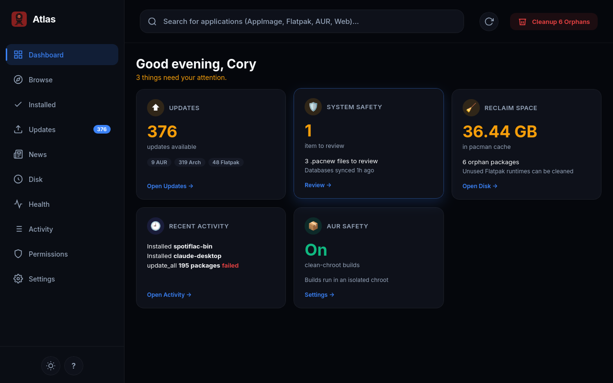
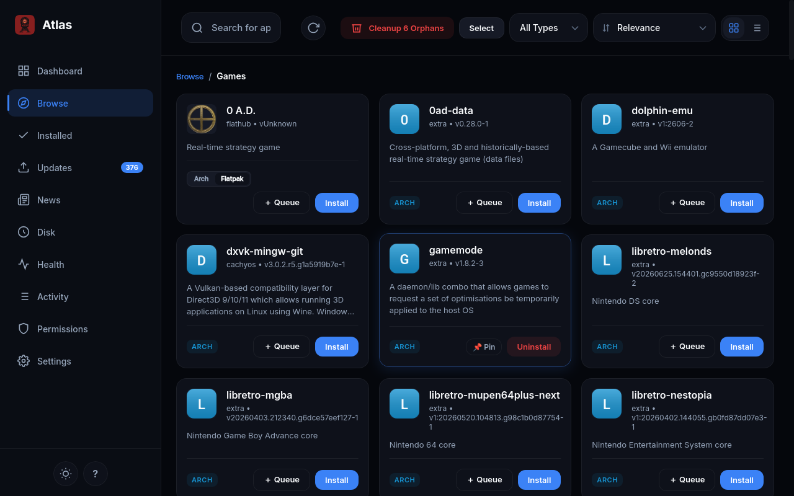
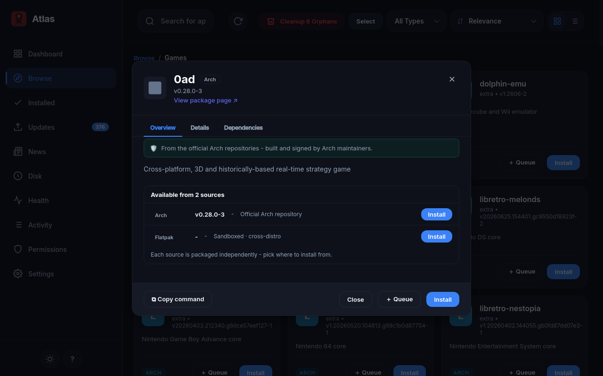
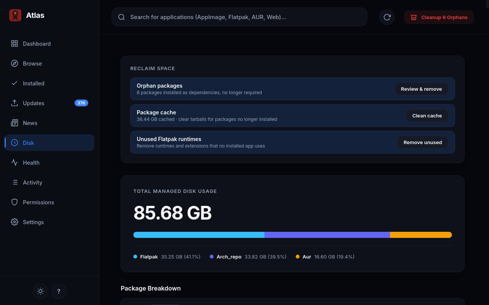
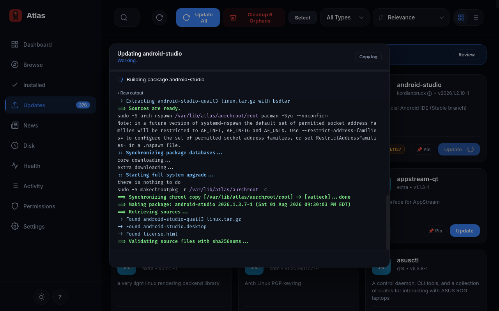

# Atlas

[](https://github.com/Vatteck/atlas/actions/workflows/ci.yml)
[](https://aur.archlinux.org/packages/atlas-pm)
[](https://aur.archlinux.org/packages/atlas-pm-git)
[](LICENSE)
[](https://www.python.org/)

<div align="center">

**The AUR is less safe than it used to be — and reading raw PKGBUILD diffs in a terminal
is overwhelming enough that most people just skip past them.**

*Atlas is a graphical package manager that surfaces the dangerous parts instead of hiding
them behind a "trust me" button.*

</div>

Built for **Arch Linux**. Battery-included for the **AUR, Flatpak, and AppImage**.
Atlas is a community fork of [bauh](https://github.com/vinifmor/bauh), rebuilt around a
**[pywebview](https://pywebview.flowrocket.com/) web UI** and a lazy-loaded engine.



---

## 🤔 Why Atlas?

Most Arch package manager GUIs fall into two camps — **terminal wrappers with buttons**
(Octopi) or **click-and-pray** (Pamac). Atlas does neither:

> [!TIP]
> **Every AUR package gets a PKGBUILD scan, a risk summary, and a "changed since your
> last build" diff — all surfaced in the UI.** Nothing is blocked, but you'll know what
> you're getting into *before* you click install.

- **One card per app, switch the source.** Arch, AUR, Flatpak, AppImage — Atlas collapses
  them into one card with a source switcher. The installed source is marked. Official repo
  is preferred over AUR. Compare versions side by side.
- **Update All, minus the parts you don't trust.** Per-source toggles let you skip AUR
  on bulk upgrades. Your choice is remembered between runs.
- **PKGBUILD forensics for normal people.** Syntax-highlighted build recipe, line-linked
  risk findings, `.install` scriptlet inspection, and maintainer-change tracking — no raw
  shell output to squint at.

---

## ✨ Highlights

| | |
|---|---|
| 🏠 **Dashboard Attention Center** | Updates, system health, AUR safety, and disk reclaim at a glance |
| 📋 **Universal transaction preview** | See every install, removal, upgrade, downgrade, and download size before confirming |
| 🔍 **PKGBUILD viewer** | Syntax-highlighted with risk annotations, diffs, and `.install` scripts |
| 🩺 **System Health cockpit** | 8+ checks: DB-sync, mirrors, locks, `.pacnew`, orphans, cache, keyring, AUR freshness |
| 🔐 **Flatseal-grade Permissions** | Safety-tiered Flatpak permissions with copyable `flatpak override` commands |
| 🕓 **History & rollback** | Filterable activity log with Downgrade/Reinstall affordances |
| ⌨️ **Command palette** | `Ctrl+K` fuzzy launcher for every page and action |
| 🎨 **Themes** | Light, Dark, Nord, Solarized Dark, High Contrast + accent color picker |

---

## 📸 Screenshots

<table>
<tr>
  <td align="center"><b>Source switcher</b></td>
  <td align="center"><b>Package details</b></td>
</tr>
<tr>
  <td><a href="docs/screenshots/apppanel.png"></a></td>
  <td><a href="docs/screenshots/details.png"></a></td>
</tr>
<tr>
  <td align="center"><b>Reclaim disk space</b></td>
  <td align="center"><b>Live transaction output</b></td>
</tr>
<tr>
  <td><a href="docs/screenshots/diskpage.png"></a></td>
  <td><a href="docs/screenshots/terminal.png"></a></td>
</tr>
</table>

---

## 📦 Install

### AUR *(recommended)*

```bash
yay -S atlas-pm          # stable release
yay -S atlas-pm-git      # bleeding-edge (HEAD)
atlas                    # launch
```

`atlas-pm-git` builds from `master`, so installing or rebuilding it always gets the latest
commit. Like every VCS package, though, its *published* AUR version string only changes when
the PKGBUILD does — so a normal `yay -Sua` won't notice new commits. To pick them up:

```bash
paru -Sua --devel        # or: yay -Sua --devel
```

### From source

<details>
<summary>Click to expand</summary>

```bash
# 1. System prerequisites (Arch)
sudo pacman -S --needed python python-pip gtk3 webkit2gtk python-gobject git

# 2. Get the code
git clone https://github.com/Vatteck/atlas.git && cd atlas

# 3. Python env + dependencies
python -m venv venv && source venv/bin/activate
pip install -r requirements.txt
pip install -e .

# 4. Run
atlas                    # GUI
atlas --logs             # GUI with logging
atlas-cli                # CLI
```

</details>

---

## 🆕 What's new in 0.16.0

- 🖥️ **Pretty transaction terminal** — syntax-highlighted pacman/makepkg output in a centered dialog
- 🧠 **First-run memory spike fixed** — initial indexing no longer buffers your whole file database
- 🧘 **Calmer config-file review** — one-line notice, "Safe to discard" mirrorlist handling
- 🌳 **Readable dependency tree** — dot-coded repo/AUR/warning rows with a legend
- 🛡️ **0.15.0's AUR vetting** — TOCTOU-safe installs, aur-audit rules, IOC database

*Full history in [CHANGELOG.md](CHANGELOG.md).*

---

## 🏗️ Architecture

Atlas is **pure Python** — a pywebview front-end (`atlas/view/webview/`) connected to one
backend "gem" per package type. No Rust, no Qt, no native extension.

| Path | Purpose |
|------|---------|
| `~/.config/atlaspm` | Configuration |
| `~/.cache/atlaspm` | Installed-app data, indexes, activity log |
| `~/.cache/atlaspm/logs/atlas.log` | Debug log (rotating, 1 MiB × 3) |
| `/tmp/atlaspm@$USER` | Temporary build/working files |

Suggestion and category data is fetched from
[Vatteck/atlas-files](https://github.com/Vatteck/atlas-files).

> For contributors: start with **[AGENTS.md](AGENTS.md)** and
> **[docs/](docs/)** → `STATUS.md`, `ARCHITECTURE.md`, `DEVELOPMENT.md`.

---

## 📄 Credits & license

Atlas is a fork of **[bauh](https://github.com/vinifmor/bauh)** by Vinícius Moreira and
contributors. Licensed under **zlib/libpng** — see [LICENSE](LICENSE).

Contributions welcome — see [CONTRIBUTING.md](CONTRIBUTING.md).
